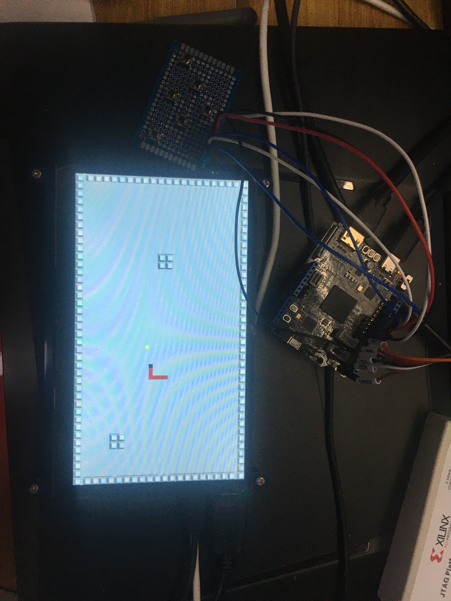

## 贪吃蛇游戏(2020年新工科联盟-Xilinx暑期学校项目)
### 项目概要：本项目是基于FPGA的贪吃蛇小游戏开发，该项目的技术核心是状态机的开发，通过接入按键和显示屏外设，最终可以实现按键控制贪吃蛇的运动方向，经过测试，游戏的逻辑功能一切正常。贪吃蛇可以实现自动运动，生长，加入了全图障碍物，死亡判断机制正常，游戏可以在显示器端正常显示。
### 工具版本：Vivado2018.3
### 板卡型号与外设列表：Sea-S7、六个按键外设、HDMI接口显示屏幕（需支持1280*720分辨率）
### 仓库目录介绍：ExecutableFiles文件夹存放项目最终生成的bit流文件，images文件夹存放作品照片，SourceCode文件夹存放的是完整项目工程。
### 作品照片：
